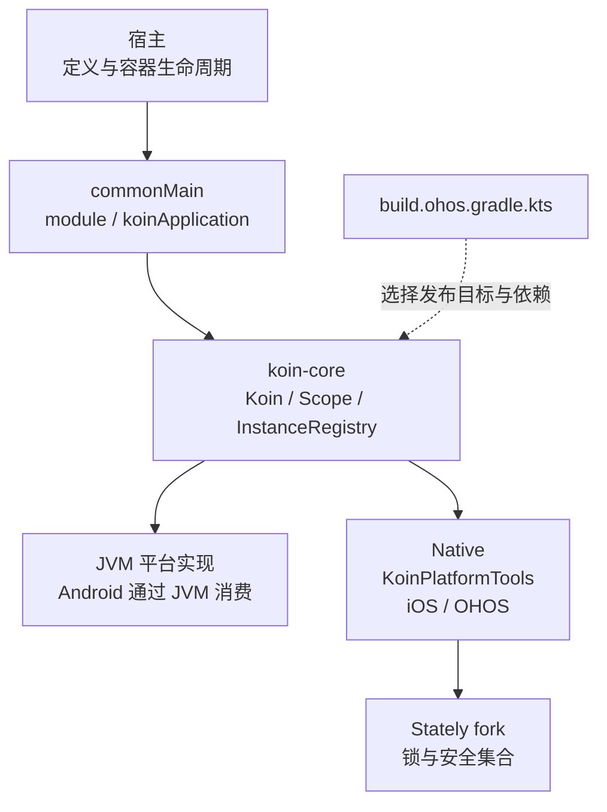
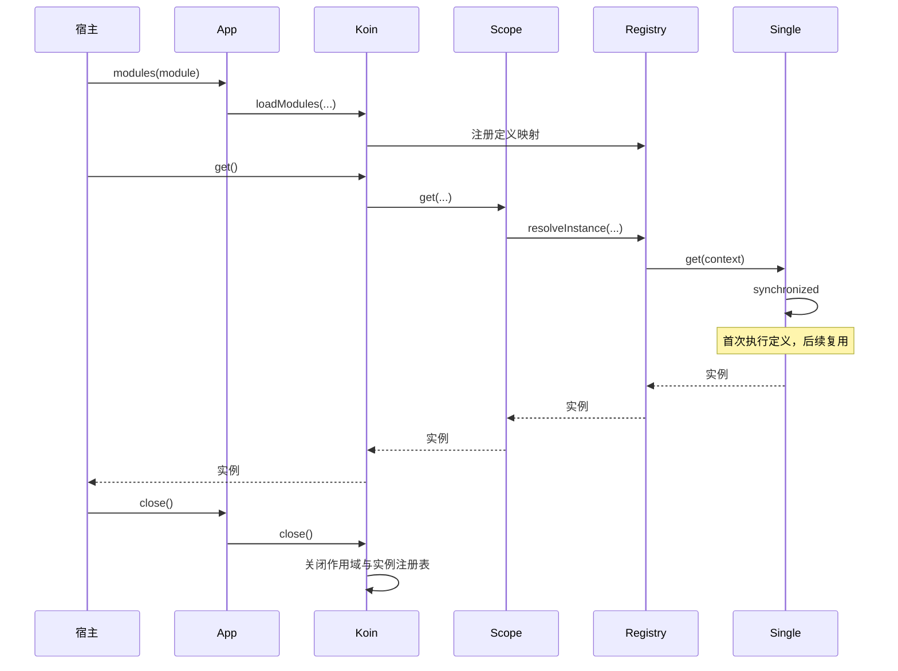
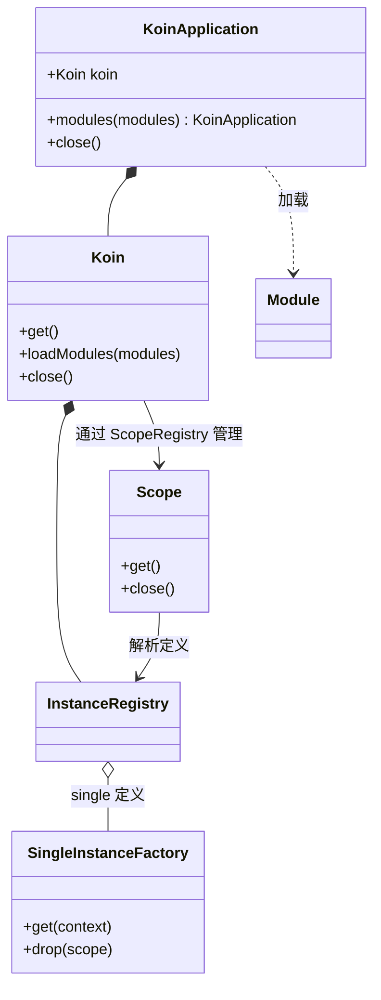

# GY CrossKit Koin OpenHarmony

为 Android、iOS 和 OpenHarmony 的 Kotlin Multiplatform 共享代码提供依赖注入。基于 [Koin 4.1.1](https://github.com/InsertKoinIO/koin)，保留 `org.koin` API，增加 `ohosArm64` 发布变体。

此 fork 只发布 `koin-core`。官方 Koin 的 Android 扩展、Compose、ViewModel 及其他模块不在本 fork 的发布范围内。

## 平台与工具链

| 平台 | 发布变体 | 接入要求 |
| --- | --- | --- |
| Android / JVM | `jvm` | Android 通过 JVM 变体消费；字节码目标 Java 8 |
| iOS | `iosArm64`、`iosSimulatorArm64`、`iosX64` | Native 编译和链接需要 macOS / Xcode |
| OpenHarmony | `ohosArm64` | 含 `ohosArm64()` 的 Kotlin 工具链及 OHOS Native SDK |

当前发布使用 Kotlin `2.2.21-1.0.0` 的 OpenHarmony 工具链。普通 Kotlin `2.2.21` 不提供 `ohosArm64()`；建议消费者使用同一工具链。仓库构建基线为 JDK 17 / Gradle 8.11.1，Android 消费验证使用 AGP 8.10.1。未独立确定最低 iOS / OpenHarmony 系统版本；系统兼容范围由宿主工具链和设备验收决定。

## 架构与调用流程

图示只覆盖本 fork 发布的 `koin-core` 容器与 Native 适配接点，不代表已审阅或发布上游全部模块。适配维护分支仍为 `codex/ohos-4.1.1`。



以下以 `single` 定义的首次解析及复用为例；时序图中的 App、Registry、Single 分别对应 `KoinApplication`、`InstanceRegistry`、`SingleInstanceFactory`。定义执行发生在调用线程，容器不会替宿主启动后台任务。





源码：[发布目标与 Stately 依赖](projects/core/koin-core/build.ohos.gradle.kts)、[容器](projects/core/koin-core/src/commonMain/kotlin/org/koin/core/KoinApplication.kt)、[Koin](projects/core/koin-core/src/commonMain/kotlin/org/koin/core/Koin.kt)、[Scope](projects/core/koin-core/src/commonMain/kotlin/org/koin/core/scope/Scope.kt)、[注册表](projects/core/koin-core/src/commonMain/kotlin/org/koin/core/registry/InstanceRegistry.kt)、[single 实例工厂](projects/core/koin-core/src/commonMain/kotlin/org/koin/core/instance/SingleInstanceFactory.kt)、[Module](projects/core/koin-core/src/commonMain/kotlin/org/koin/core/module/Module.kt)。

[Native KoinPlatformTools](projects/core/koin-core/src/nativeMain/kotlin/org/koin/mp/KoinPlatformTools.kt) 使用 Stately 的 `withLock`、`ConcurrentMutableMap` / `ConcurrentMutableSet`；单例创建同步并不使业务实例自动线程安全。宿主负责停止实例使用后关闭独立容器；不由 DI 容器自动取消业务协程。上游来源、未发布模块和设备验证边界见下文。

## 安装

在项目的 `settings.gradle.kts` 中加入 JitPack：

```kotlin
dependencyResolutionManagement {
    repositories {
        google()
        mavenCentral()
        maven { url = uri("https://jitpack.io") }
    }
}
```

在共享模块的 `build.gradle.kts` 中添加：

```kotlin
kotlin {
    sourceSets {
        commonMain.dependencies {
            implementation("com.github.gycrosskit.koin-ohos:koin-core:4.1.1-ohos-2.2.21-6")
        }
    }
}
```

Gradle 根据 KMP 元数据选择平台产物，并传递引入 Stately OpenHarmony `2.1.0-ohos-2.2.21-10`。本 fork 坐标与上游 `io.insert-koin:koin-core` 不同；与官方 Koin Compose 同用时按[接入指南](docs/接入指南.md#与官方-koin-compose-同用)配置依赖替换，避免重复 Native KLIB。

## 快速使用

在 `commonMain` 中定义并使用独立容器：

```kotlin
import org.koin.dsl.koinApplication
import org.koin.dsl.module

class Repository
class Service(val repository: Repository)

val application = koinApplication {
    modules(module {
        single { Repository() }
        factory { Service(get()) }
    })
}
val service = application.koin.get<Service>()
// 宿主结束使用容器且所有调用已完成后：
application.close()
```

## 文档与支持

- [接入指南](docs/接入指南.md)：官方 Compose 依赖替换和容器生命周期。
- [构建与验证](OHOS_PORT.md)：发布流程、独立消费工程和验收范围。
- [上游英文介绍](README_EN.md)、[Koin 文档](https://insert-koin.io/docs/reference/koin-core/dsl/)：通用 API；其中上游坐标不能代替本 fork 的鸿蒙坐标。
- [GitHub Releases](https://github.com/gycrosskit/koin-ohos/releases)：版本与发布归档；JitPack 使用同版本的 Maven 归档提供依赖。
- [GitHub Issues](https://github.com/gycrosskit/koin-ohos/issues)：报告适配问题时提供依赖版本、工具链、平台和最小复现。

已有验证覆盖 Android 编译、iOS KLIB 编译与模拟器 Framework 链接、OHOS 动态库链接及 JVM 注入运行；iOS/OHOS 设备运行尚未验证。详细记录见构建与验证文档。

OpenHarmony 适配维护在 `codex/ohos-4.1.1`；默认 `main` 保留上游基线。上游更新不代表已移植到本 fork 的发布版。

本 fork 与上游 Koin 均遵循 Apache-2.0，见 [LICENSE](LICENSE)。
